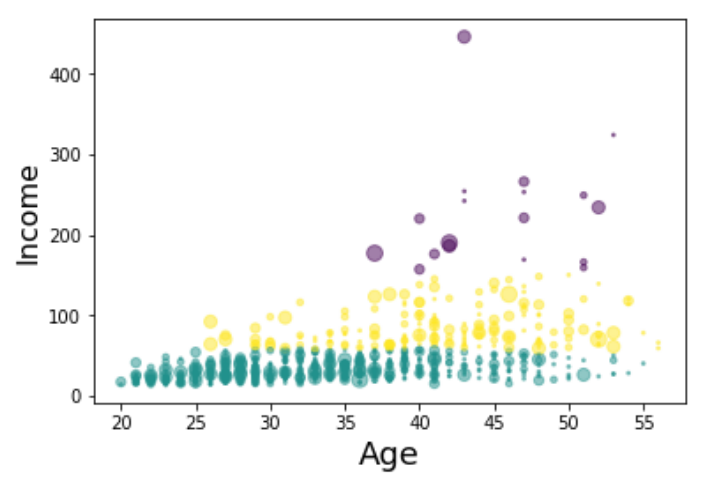

# K-Means Clustering

k-means clustering is a method of vector quantization, originally from signal processing, that aims to partition n observations into k clusters in which each observation belongs to the cluster with the nearest mean (cluster centers or cluster centroid), serving as a prototype of the cluster.

We create our own dataset by using numpy's random.seed() function, where the seed will be set to 0.

    np.random.seed(0)
    
This is what it looks like:

Once we have the random data generated and the KMeans model initialized, let's plot them and see what it looks like:

Then we make random clusters of points by using the make_blobs class.
    
    X, y = make_blobs(n_samples=5000, centers=[[4,4], [-2, -1], [2, -3], [1, 1]], cluster_std=0.9)

Then, initialize KMeans with these parameters, where the output parameter is called k_means.
    
    k_means = KMeans(init = "k-means++", n_clusters = 4, n_init = 12)

Then, we fit the KMeans model with the feature matrix
    
    k_means.fit(X)

Grab the labels for each point in the model using KMeans' .labels_ attribute and save it as k_means_labels and get the coordinates of the cluster centers using KMeans' .cluster_centers_

Let's load Data From CSV File

Address in this dataset is a categorical variable. k-means algorithm isn't directly applicable to categorical variables because Euclidean distance function isn't really meaningful for discrete variables. So, lets drop this feature and run clustering.

    df = cust_df.drop('Address', axis=1)

Now let's normalize the dataset.

Normalization helps mathematical-based algorithms to interpret features with different magnitudes and distributions equally. We use StandardScaler() to normalize our dataset.

    X = df.values[:,1:]
    X = np.nan_to_num(X)
    Clus_dataSet = StandardScaler().fit_transform(X)

Lets apply k-means on our dataset, and take look at cluster labels.

    clusterNum = 3
    k_means = KMeans(init = "k-means++", n_clusters = clusterNum, n_init = 12)
    k_means.fit(X)
    labels = k_means.labels_

Now, let's look at the distribution of customers based on their age and income:

And this is what its 3D plot would look like:

